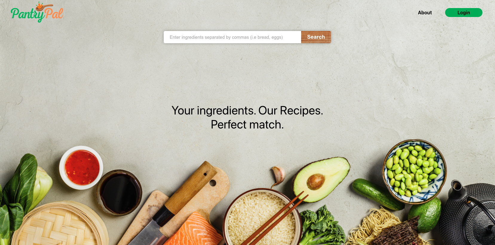
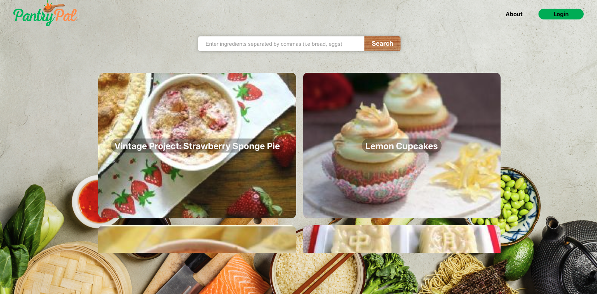
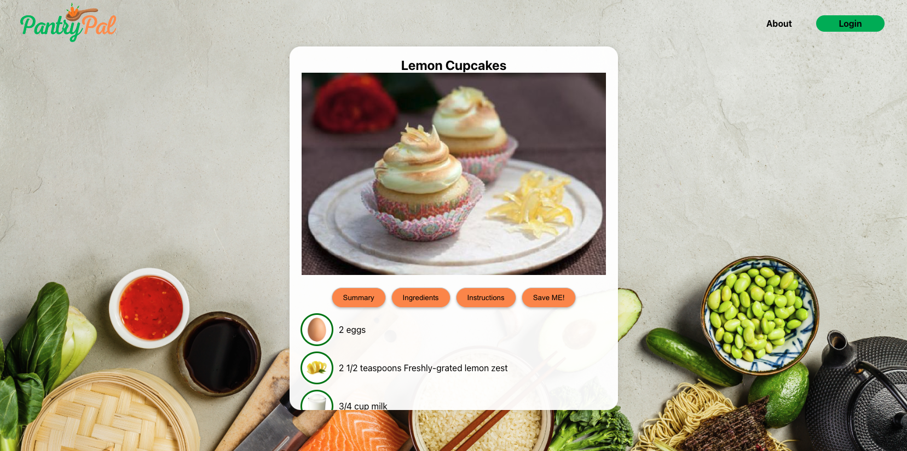
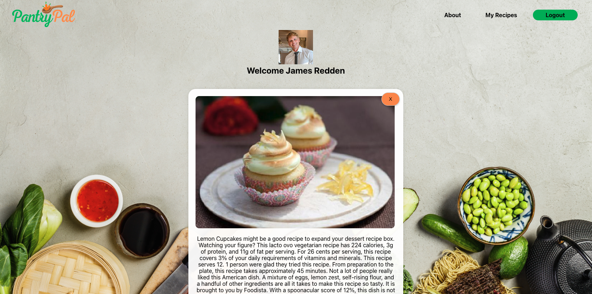

Have you ever stared into your fridge or pantry, wondering what you can cook with the ingredients at hand? Pantry Pal is here to save your day for breakfast, lunch and dinner!

## About Pantry Pal
Pantry Pal is a delightful solution for those days when inspiration doesn't strike or when you're trying to minimize grocery store trips. The app is tailored to help you whip up delicious meals with what you've got on hand.

## How Do I Use Pantry Pal? 
Click on this link to access the app: https://thepantrypal.netlify.app

Simply enter the ingredients you have on hand in the searchbar, and Pantry Pal will present you with a curated list of delicious recipes tailored to your pantry's content.
Fall in love with a dish? Save the recipe with just a click, so you can revisit and cook it anytime you crave it.

## Technologies Used:
    
1. Mongo DB 
2. Express.js
3. React 
4. Node.js 
5. Spoonacular API

## Future Features: 

1. Fix deployment issues and bugs

#### Creator Of Pantry Pal:
James Redden [GitHub](https://github.com/jaredden1) | [LinkedIn](https://www.linkedin.com/in/jamesredden1/)

© 2023 Pantry Pal. All rights reserved.